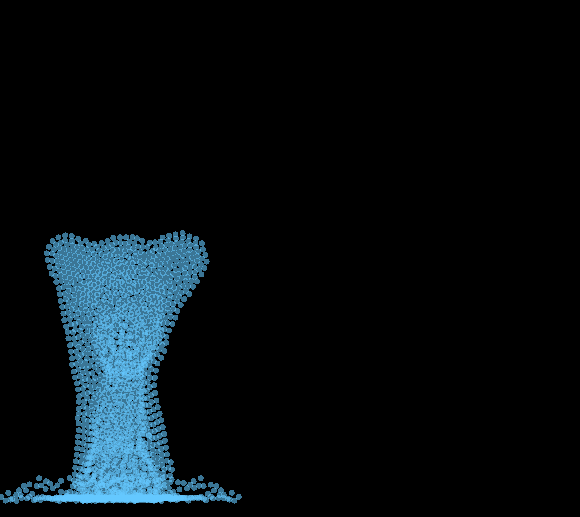

# particle_hydrodynamics
2d lagrangian-based fluid simulator. Runs smoothly with over 2000 particles, and further graphical optimizations should improve this. User can interact with the fluid via mouse, and more features should be available soon. I'm also working on using CMake instead of Microsoft Visual Studio to compile the code. 
A working executable is in the release folder. Stay tuned for more features.

The Simulation techniques used in this project were based on the attached paper by Matthias Muller et Al.
https://people.cs.clemson.edu/~dhouse/courses/817/papers/mueller03.pdf

.png)
.png)
.png)
